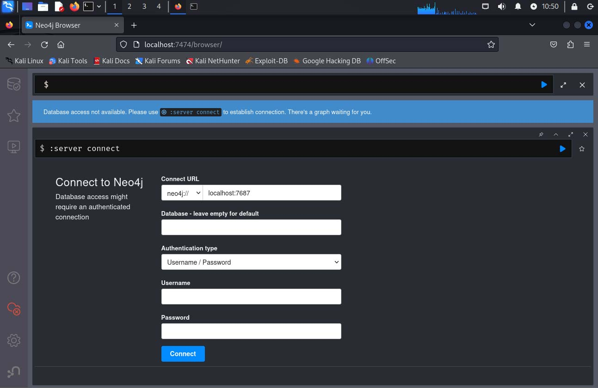
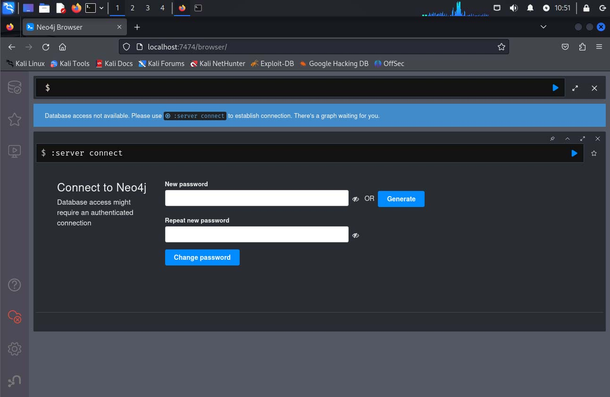
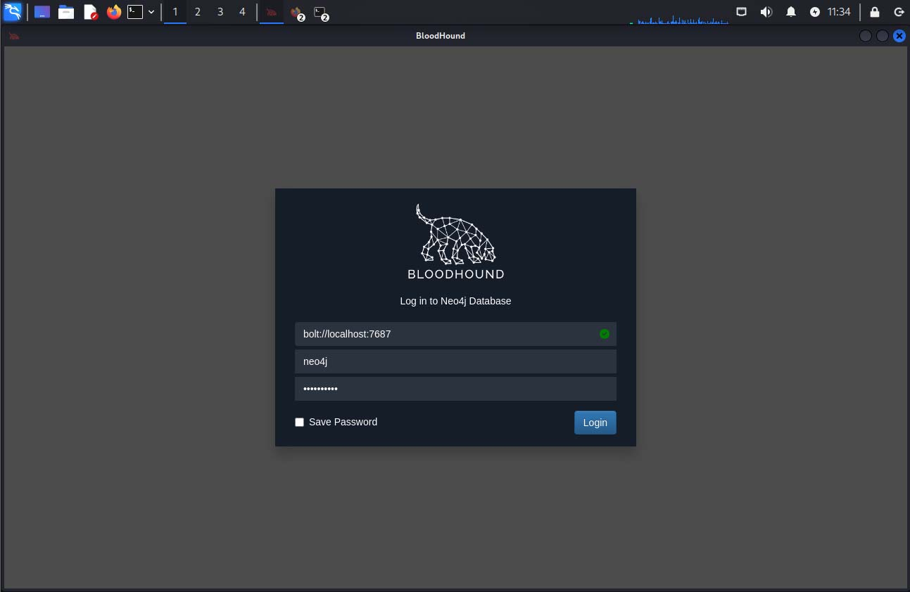
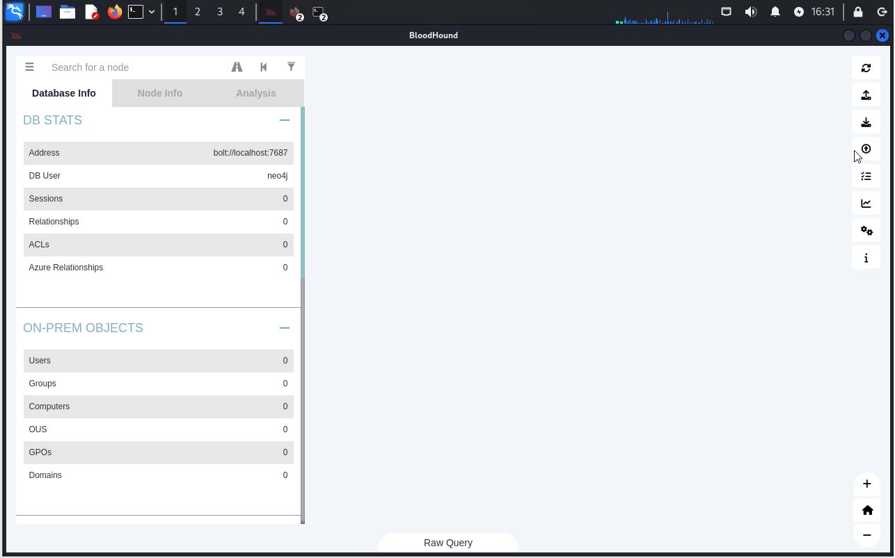
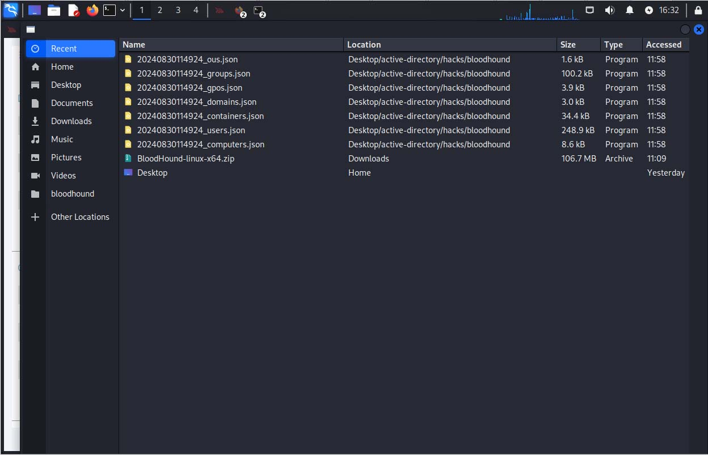
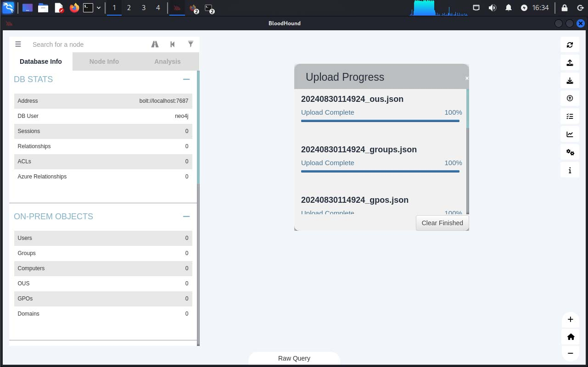
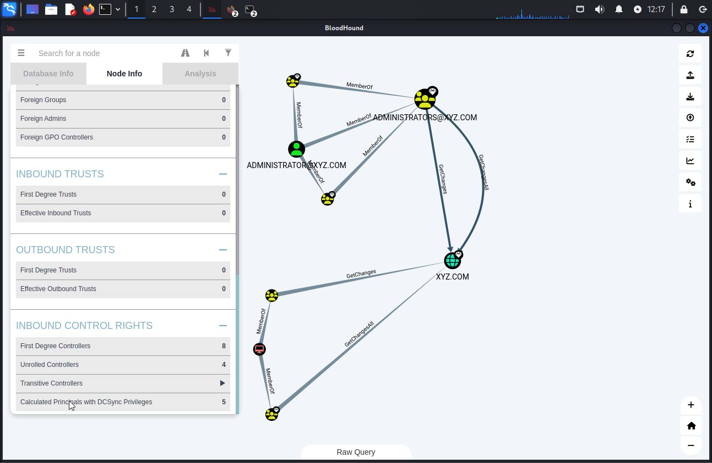
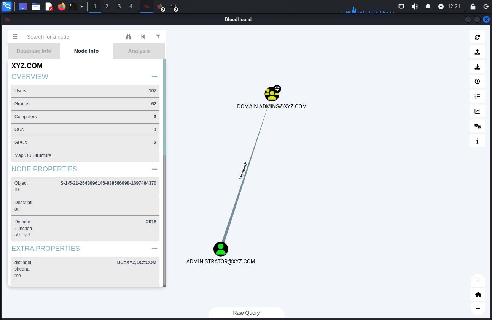

# [BLOODHOUND Domain Enumeration (Active Directory #06)](https://www.youtube.com/watch?v=yp8fw72oQvY)
[Bloodhound](https://github.com/BloodHoundAD/BloodHound) is a single page Javascript web application, built on [Linkurious](https://linkurious.com/), compiled with [Electron](https://www.electronjs.org/), using [Neo4j database](https://neo4j.com/) fed by [C# data collectors](https://github.com/BloodHoundAD/BloodHound/tree/master/Collectors).

Once you import data collected from an **AD** using one the **injestors** (data collectors), It allows you to run queries on the loaded data and it povides an interactive graphical way of viewing the answers!!!

In this section we will be taking these steps:
1. Install neo4j database
2. Show how to configure and run neo4j to support the **BloodHound** tool
3. Download the latest **x64 binary** of the **BloodHound** tool
4. Run the **bloodhound-python** injestor tool to collect Active Directory (AD) data from **DC1**
5. Run the **BloodHound** tool and then **upload** the json files that the **bloodhound-python** injestor tool created
6. Run some queries in **BloodHound** to show some examples

---
We need to start by installing neo4j
```
┌──(jim㉿kali)-[~/Desktop/active_directory/hacks/bloodhound]
└─$ sudo apt install neo4j
```
Stop neo4j
```
┌──(jim㉿kali)-[~/Desktop/active_directory/hacks/bloodhound]
└─$ systemctl stop neo4j
```
Make sure you edit **/etc/neo4j/neo4j.conf** to uncomment the line:
```
dbms.default_listen_address=0.0.0.0
```
Start up neo4j as a console app
```
┌──(jim㉿kali)-[~/Desktop/active_directory/hacks/bloodhound]
└─$ sudo neo4j console
```

Open a browser window and go to http://localhost:7474/



When **neo4j** first comes up it expects a user:password
```
neo4j:neo4j
```
It will prompt you to change the password -> use: 
```
Password: bloodhound, bloodhound
```


**NOTE:** Keep **neo4j** running as it supports the **BloodHound** tool which won't run without it

---
Time to run the **bloodhound-python** injestor to collect all the AD data for **Bloodhound** tool.

First we need creds for a domain user (alice, bubbles):
```
┌──(jim㉿kali)-[~/Desktop/active-directory/hacks/bloodhound]
└─$ bloodhound-python -u alice -p bubbles -dc dc1.xyz.com -disable-autogc -d xyz.com -c all
INFO: Found AD domain: xyz.com
INFO: Getting TGT for user
INFO: Connecting to LDAP server: dc1.xyz.com
INFO: Found 1 domains
INFO: Found 1 domains in the forest
INFO: Found 3 computers
INFO: Connecting to LDAP server: dc1.xyz.com
INFO: Found 107 users
INFO: Found 62 groups
INFO: Found 2 gpos
INFO: Found 1 ous
INFO: Found 19 containers
INFO: Found 0 trusts
INFO: Starting computer enumeration with 10 workers
INFO: Querying computer: WS2.xyz.com
INFO: Querying computer: WS1.xyz.com
INFO: Querying computer: DC1.xyz.com
INFO: Done in 00M 02S
```
**REMINDER:** the data we collected above was creaded in **AD05** - It represents 100 random users and 10 random groups

Here is the list of files it created:
```
┌──(jim㉿kali)-[~/Desktop/active-directory/hacks/bloodhound]
└─$ ls -la
total 416
drwxrwxr-x 2 jim jim   4096 Aug 30 11:49 .
drwxrwxr-x 4 jim jim   4096 Aug 29 22:13 ..
-rw-rw-r-- 1 jim jim   8644 Aug 30 11:49 20240830114924_computers.json
-rw-rw-r-- 1 jim jim  34419 Aug 30 11:49 20240830114924_containers.json
-rw-rw-r-- 1 jim jim   3032 Aug 30 11:49 20240830114924_domains.json
-rw-rw-r-- 1 jim jim   3920 Aug 30 11:49 20240830114924_gpos.json
-rw-rw-r-- 1 jim jim 100188 Aug 30 11:49 20240830114924_groups.json
-rw-rw-r-- 1 jim jim   1617 Aug 30 11:49 20240830114924_ous.json
-rw-rw-r-- 1 jim jim 248863 Aug 30 11:49 20240830114924_users.json
```

---
Now we are ready to install **Bloodhound**

Open web browser window and enter https://github.com/BloodHoundAD/BloodHound/releases/download/v4.3.1/BloodHound-linux-x64.zip

This will download the lastest **x64 binary** of **BloodHound** to the Downloads directory.

Unzip it:
```
┌──(jim㉿kali)-[~/Downloads]
└─$ unzip BloodHound-linux-x64.zip
```

Change name of the folder:
```
┌──(jim㉿kali)-[~/Downloads]
└─$ mv BloodHound-linux-x64/ BloodHound/
```

Change to root and move to /opt:
```
┌──(jim㉿kali)-[~/Downloads]
└─$ sudo su -                                       
┌──(root㉿kali)-[~]
└─# cd /opt
```

Move BloodHound folder to /opt:
```
┌──(root㉿kali)-[/opt]
└─# mv /home/jim/Downloads/BloodHound/ .
```

Exit root
```
┌──(jim㉿kali)-[~/Downloads]
└─$
```

---
Should now be able to run **BloodHound** and upload some data
```
┌──(jim㉿kali)-[~/Desktop/active_directory/hacks/bloodhound]
└─$  /opt/BloodHound/BloodHound --no-sandbox
```
A window will apear asking you to log in with **username, password** - use below:
```
neo4j, bloodhound
```


---
A blank **BloodHound** screen is now ready for your data upload!



It is now time to **upload** some data into **Bloodhound**

On the left side above, the **arrow** is pointing to how to **upload** the json files that the **bloodhound-python** tool created.

Make sure you are selecting the right json files for import



You now see the results of the upload:



You can click on the "x" on the **Upload Progress** popup once the upload completes

You now can run queries via panel on the left hand side:



Here is another query showing a summary of the data that was loaded:



It works !!!

---
The documentation for Bloodhound can be found [here](https://bloodhound.readthedocs.io/en/latest/data-analysis/bloodhound-gui.html)

You can now run your own queries in **BloodHound** on the data you imported !!!

**SANS** has a nice Intro to [Bloodhound](https://www.sans.org/blog/bloodhound-sniffing-out-path-through-windows-domains/)

---
END OF THIS VIDEO !

---
---
# ADDENDUM

**NOTE:** If you need to clear out any previous Bloodhound data follow these steps:
- Make sure you have neo4j running:
```
┌──(jim㉿kali)-[~/Desktop/active_directory/hacks/bloodhound]
└─$ sudo neo4j console
```
- In another terminal window, make sure you have Bloodhound running:
```
┌──(jim㉿kali)-[~/Desktop/active_directory/hacks/bloodhound]
└─$ /opt/bloodhound/BloodHound --no-sandbox
```
- Log in to "Bloodhound" with your creds
```
neo4j:bloodhound
```
- Once Bloodhound finished to load, a panel shows up on the far left hand side
- At the very bottom there is a "Clear Database" tab
- You may have to "minimize (-)" some items on the panel to see the bottom
- I think you need to log out and back in to make sure that that the data is gone
- If you still have problems finding "Clear Database" tab - [here is a link to a reference](https://www.pentestpartners.com/security-blog/bloodhound-walkthrough-a-tool-for-many-tradecrafts/) - just search for "info tab".
---
END OF FILE !